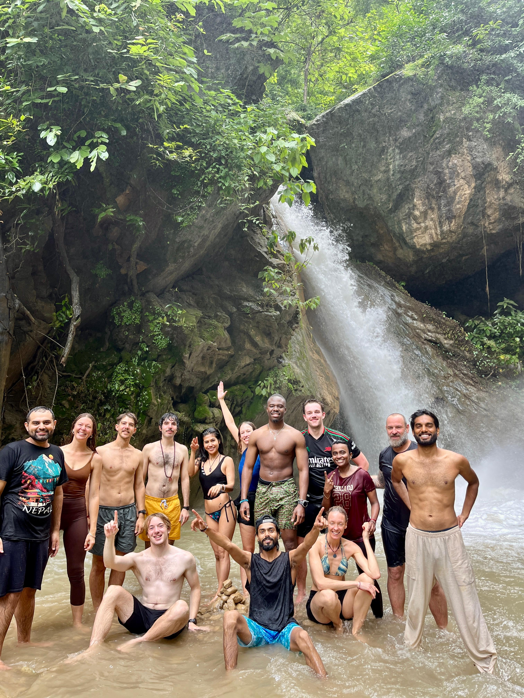
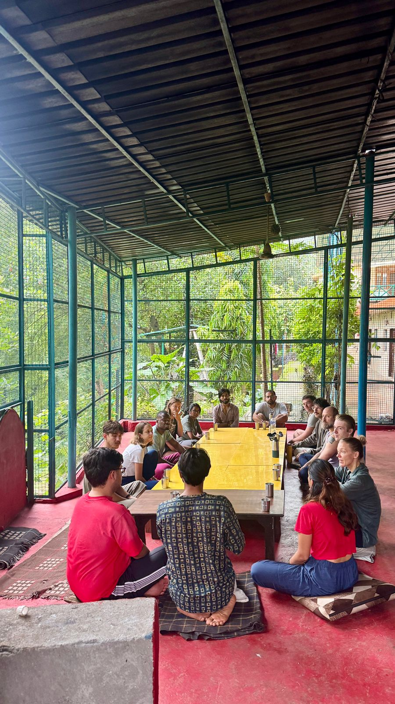
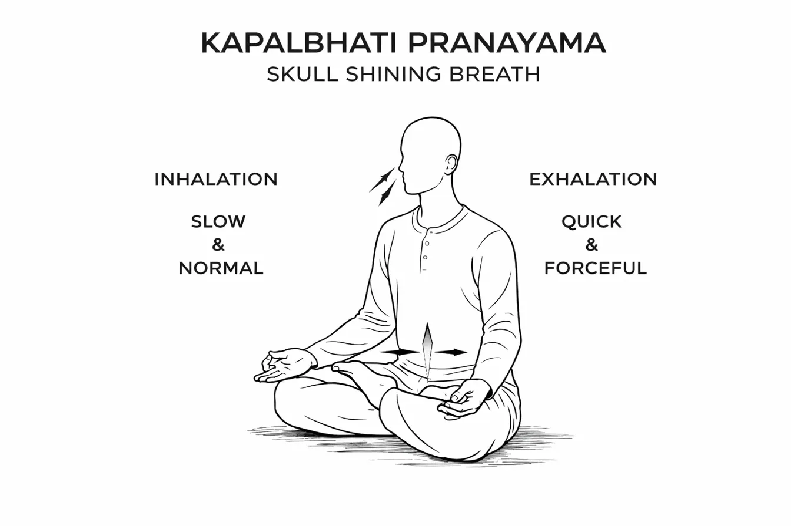
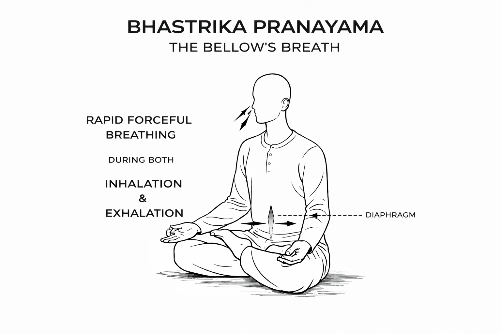
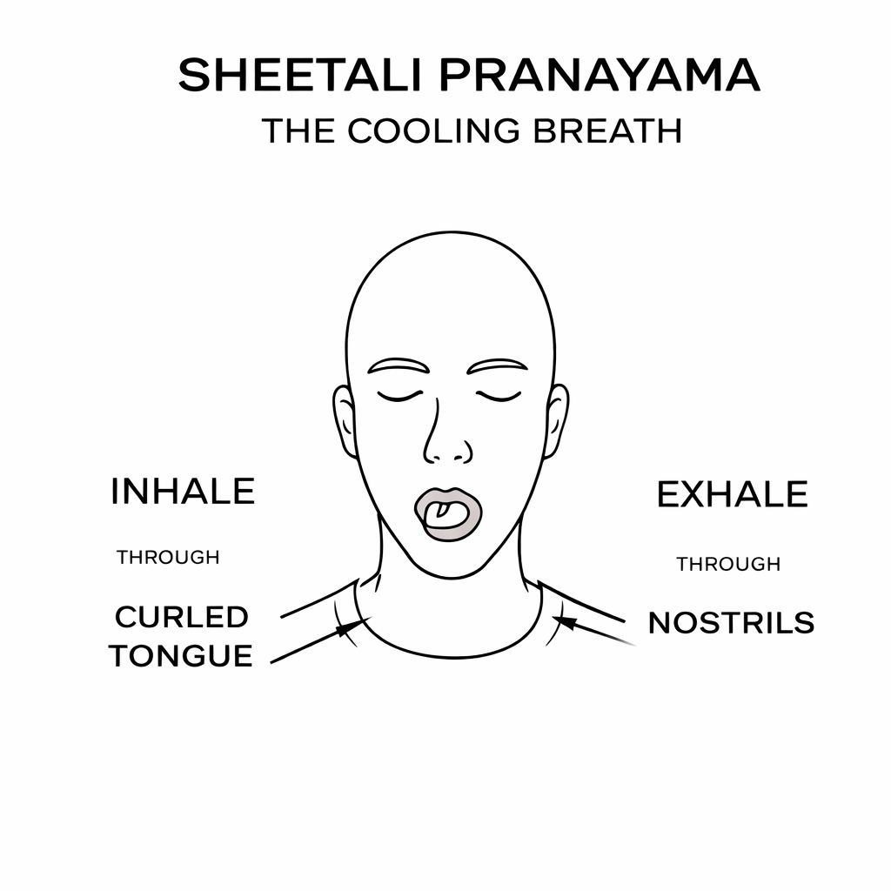
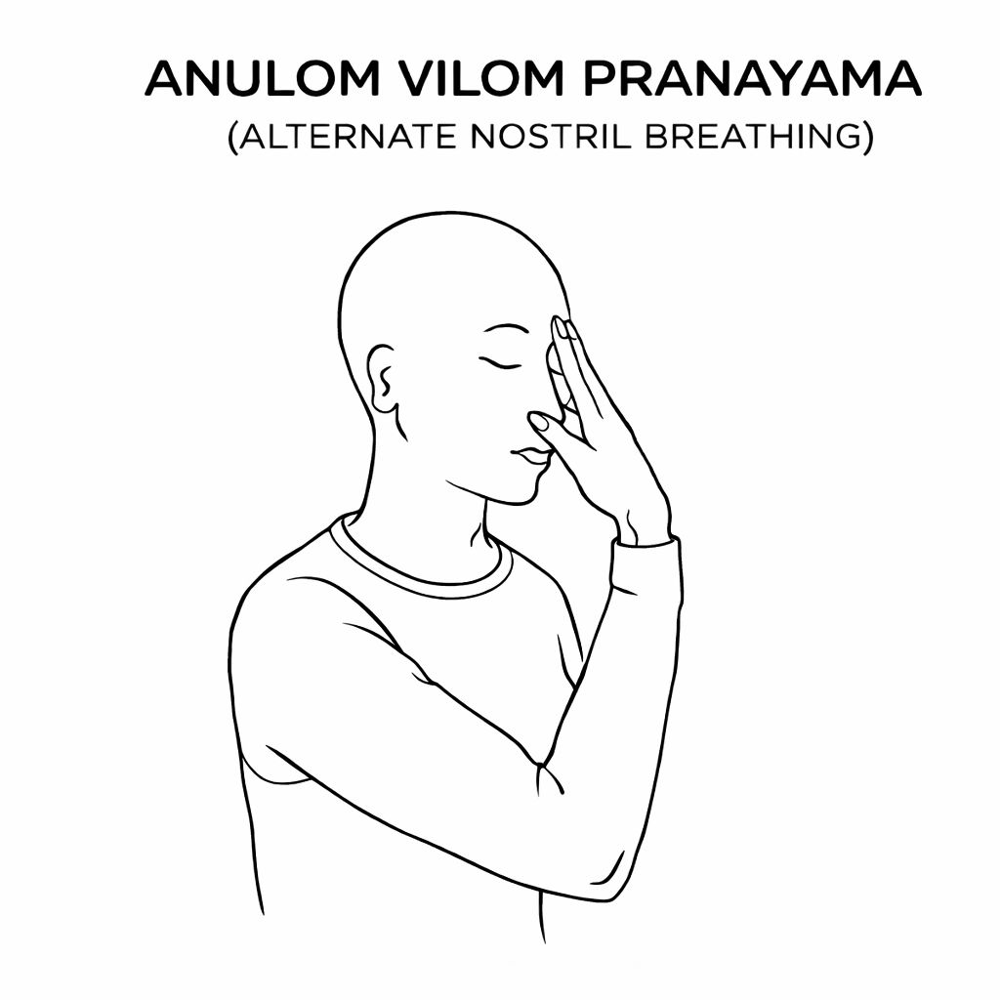
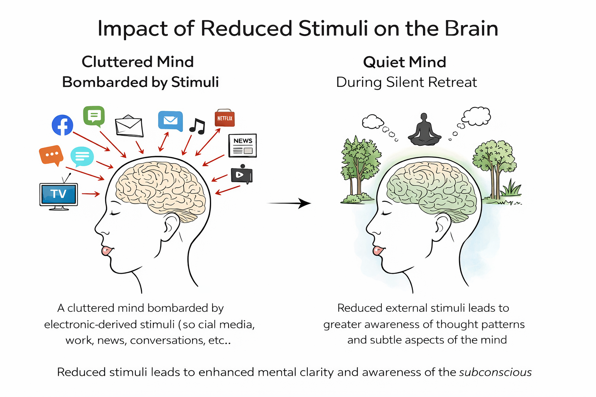
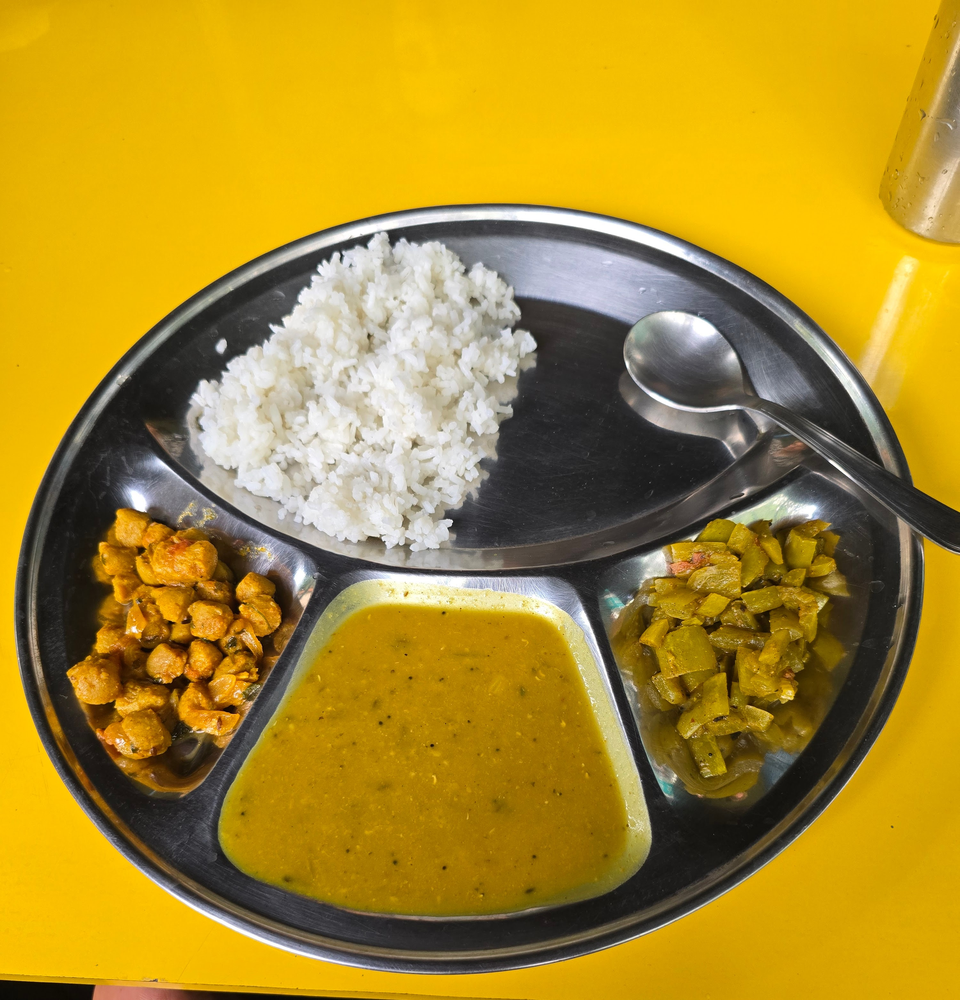
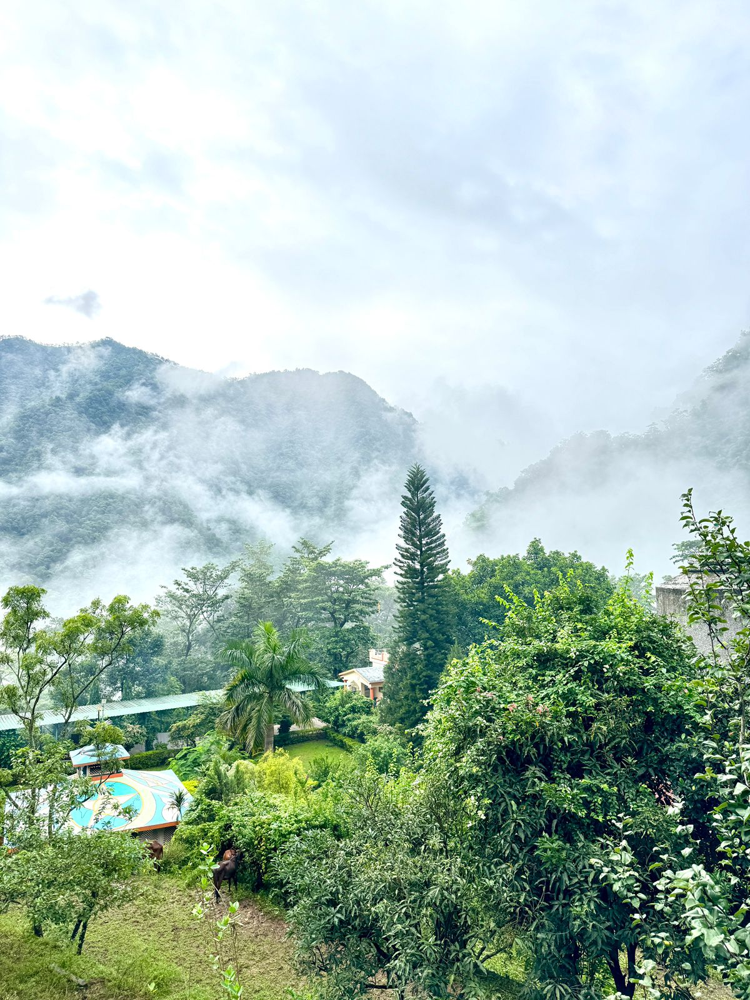
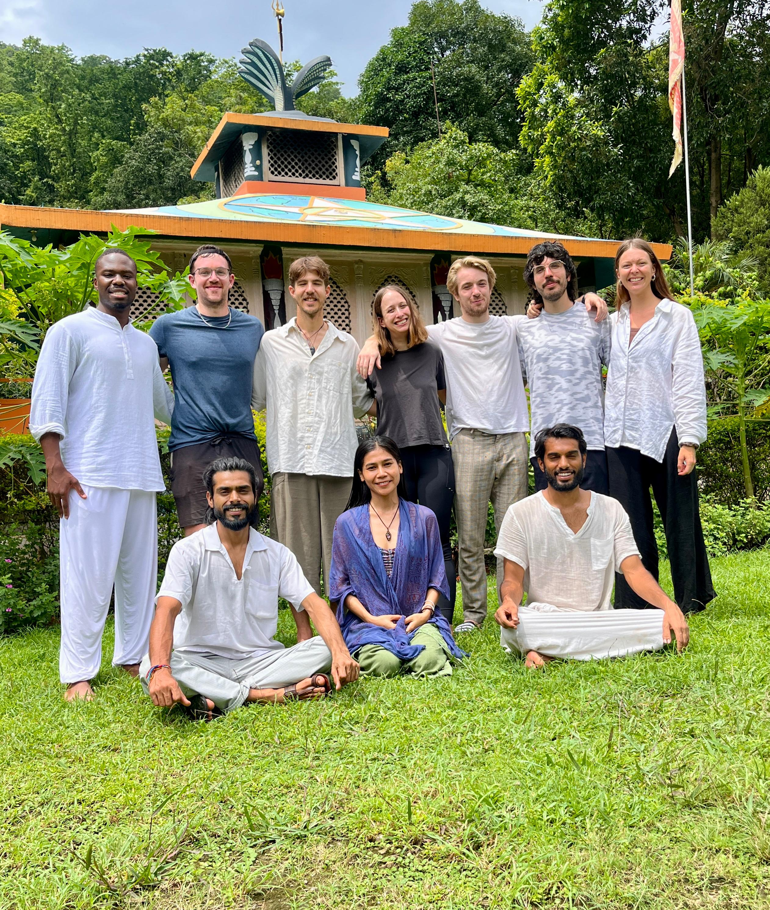

Looking back on 2025, I spent 11 days in Rishikesh, India, for a [silent retreat](https://bookretreats.com/r/11-day-vipassana-silent-awakening-meditation-program-in-india?a=jqfxn) to deepen my understanding of yoga and meditation.

I've been meditating for about 12 years (mainly self-taught via YouTube and some in-person classes in London), but I wanted to experience it from an authentic perspective at an actual ashram. Reading books like the [Autobiography of a Yogi](https://amzn.to/4qqY6Z9) and [Raja Yoga](https://amzn.to/49FTDKZ) had me curious for years.

As I was navigating some significant decisions in my career and life, I felt called to go deeper. I wanted to step away from the constant stream of information, deadlines, and digital noise to gain clarity on what really mattered.

The [retreat](https://bookretreats.com/r/11-day-vipassana-silent-awakening-meditation-program-in-india?a=jqfxn) was held at the [Abhyasa Yogmath Ashram](https://www.abhyasayogmath.com/), which is a beautiful ashram nestled in the Himalayan jungle near the Ganges River. The program was 11 days and included 7 days of silence from days 4 to 11. We also enjoyed a trip to the nearby waterfall on day 3 which was lots of fun!

A typical silence day schedule would look like:

- 5:30am - Pranayama
- 7:30am - Hatha Yoga
- 9:00am - Breakfast
- 11:30am - Meditation
- 1pm - Lunch
- 3pm - Meditation & Sound Healing
- 5pm - Meditation
- 7:45pm - Dinner

During the silence: no phones, no reading, no mirrors, no eye contact. Only 30 minutes of journaling per day.

Weirdly, I coped pretty well with those restrictions. The hardest part? Sitting cross-legged for up to 1.5 hours at a time during meditations, pranayama, and even meals. That's around 7.5+ hours of sitting per day. My knees and thighs were screaming despite using cushions.

Here are some of the things I learned during the retreat:

## Learning 1: Pranayama and the Power of the Breath

In Sanskrit, Prana = life force and yama = control - so it's essentially a practice for expanding your life force using breathing control techniques. During the retreat, we had a daily pranayama session first thing in the morning for 1.5 hours and it was one of my favourite sessions. I would always come out feeling energised (lit up like a Christmas tree 🎄) and learned some powerful breathing techniques for increasing energy, reducing stress and also creating a sense of calmness in the mind.

Some of them include:

---

***Note:** This post shares my personal experience at a retreat in India. I'm not a yoga or pranayama instructor—just someone documenting what I learned. If you're interested in pranayama, I'd recommend learning from a qualified teacher who can guide you properly.*

---

### 1. Kapalbhati Pranayama (Skull Shining Breath)

In Sanskrit, *Kapal* means cranium/skull while *Bhati* means shining/illuminate/knowledge. Together, Kapalbhati translates to "Skull Shining Breath" or "Frontal Brain Purification," suggesting it illuminates and purifies the skull and surrounding organs [[1]](https://www.banyanbotanicals.com/pages/ayurvedic-kapalabhati-pranayama). In Hatha yoga, Kapalbhati is considered one of the six **ShatKarmas** (purification practices) designed to remove impurities from the body [[2]](https://www.arhantayoga.org/blog/shat-kriyas-yogic-cleansing-guide/). Unlike most breathing exercises that emphasize controlled inhalation, Kapalbhati reverses this pattern by making the exhalation active and forceful while allowing the inhalation to happen passively and effortlessly.

**How to Practice**

*Preparation:*

1. Find a clean, pollution-free environment (ideally outdoors in gardens or parks)
2. Sit in a meditative pose: Sukhasana (Easy Pose), Padmasana (Lotus Pose), or Vajrasana (Thunderbolt Pose)
3. Keep your spine erect and chin parallel to the ground
4. Place palms facing downward on your knees
5. Close your eyes
6. Begin with normal breathing to relax the body and mind

*Technique:*

1. **Inhalation**: Breathe in through your nose - this should be PASSIVE and effortless (happens naturally)
2. **Exhalation**: Exhale forcefully and quickly through your nose by sharply contracting your lower belly/abdominal muscles, drawing the navel toward the spine
3. The emphasis is entirely on the SHORT, STRONG, FORCEFUL exhalation
4. The inhalation happens automatically as you release the abdominal contraction - don't think about it
5. Keep your stomach and chest relatively stable with minimal conscious movement
6. The exhalations and inhalations should be of equal duration

**Duration & Important Notes:**

Start with 20-30 breaths per round and gradually build up to 40-50 breaths. I'd practice 3-5 rounds with rest in between - anywhere from 5-30 minutes total depending on your experience. Best to practice on an empty stomach in the early morning. Focus on the forceful exhalation - the inhalation takes care of itself. If you feel dizzy, just stop and breathe normally. Don't practice during menstruation or pregnancy.

**My Experience**

I've incorporated Kapalbhati into my daily schedule, and it has provided me with a great sense of mental clarity and increased energy throughout the day. During our morning pranayama sessions at the ashram, this practice always left me feeling energised - lit up like a Christmas tree 🎄. There's something about the rhythmic, forceful exhalations that seems to clear mental fog and wake up every cell in your body. It became my go-to practice for mornings when I needed that extra boost of clarity and focus.

**Benefits**

What fascinated me most about Kapalbhati was learning about its traditional name - "Skull Shining Breath." Our instructors explained this refers to how the practice creates a "shining" quality in the mind, awakening dormant brain centers responsible for subtle perception. I found the rhythmic breathing naturally quieted my mental chatter, making it ideal preparation for deeper meditation sessions. It also helped me release stored emotional tensions, bringing this sense of lightness I hadn't expected.

From a physical standpoint, Kapalbhati is traditionally described as a "Frontal Brain Cleaning Technique," with research suggesting it may help drain excess mucus from the paranasal cavities [[3]](https://journals.lww.com/jopc/fulltext/2023/04010/effect_of_vatakarma_kapalbhati_on_sinus_headache.7.aspx). Clinical studies have shown significant improvement in sinus headaches, sleep quality, and sinonasal outcomes [[4]](https://doaj.org/article/ca042a8c44d544f0bd2d57bd9b4006fe)[[3]](https://journals.lww.com/jopc/fulltext/2023/04010/effect_of_vatakarma_kapalbhati_on_sinus_headache.7.aspx), which makes sense given how the practice works.

I was also curious about what was happening in my brain during the practice. Research shows changes in heart rate variability (HRV) and brain wave patterns during and after Kapalbhati [[5]](https://pmc.ncbi.nlm.nih.gov/articles/PMC8963645/). Studies suggest the practice may improve blood circulation to the brain, which could explain why I always felt sharper and more focused afterward. The enhanced cognitive function and concentration weren't just in my head - there's actual science backing it up.

The digestive and metabolic benefits were unexpected for me. The forceful exhalations strengthen your abdominal muscles and stimulate abdominal organs, improving their function and vitality. Interestingly, an eight-week study on 60 overweight resident doctors showed weight loss and reduced waist/hip circumference [[6]](https://www.jemds.com/data_pdf/5_dinkar.pdf), which suggests the practice may have metabolic effects.

Laslty, a study with runners found that 3 weeks of daily Kapalbhati practice (combined with Bhastrika and Dirgha breathing, 30 minutes per day) led to improvements in forced vital capacity (FVC) and forced expiratory volume (FEV1) [[7]](https://pmc.ncbi.nlm.nih.gov/articles/PMC7039472/). What's particularly interesting is that participants reported the high-intensity running "felt easier" after the breathing practice - their ratings of perceived exertion for leg fatigue decreased during hard efforts, even though their actual running economy didn't change significantly in this short timeframe. This suggests Kapalbhati may help with the subjective experience of hard exercise, potentially delaying the perception of fatigue.

**Video Resource**:

- [Kapalbhati Pranayama - The School Of Breath](https://www.youtube.com/watch?v=io5VdgwD2gk&t=247s)

---

### 2. Bhastrika Pranayama (Bellows Breath)

In Sanskrit, *Bhastrika* means "bellows" - like the tool used to stoke a fire. This pranayama generates internal heat and energy through rapid, forceful breathing that mimics the action of a blacksmith's bellows. Our instructors taught us that this technique is particularly powerful for increasing vitality and preparing the body for deeper meditation practices.

**How to Practice**

*Preparation:*

1. Sit in a comfortable meditative pose with your spine erect
2. Place your hands on your knees, palms facing upward or in chin mudra (thumb and index finger touching)
3. Close your eyes and relax your body
4. Take a few deep breaths to center yourself

*Technique:*

1. **Both inhalation and exhalation are forceful and equal** - this is what distinguishes it from Kapalbhati
2. Breathe rapidly through your nose with force, expanding the chest on inhale and contracting on exhale
3. Both the inhalation and exhalation should be powerful and audible
4. Use your diaphragm actively to pump the breath in and out
5. Keep your body stable while focusing the movement in your torso
6. Maintain a steady, rhythmic pace - like stoking a fire

**Duration & Important Notes:**

Start with 10-15 rapid breaths per round and build up to 30-40 as you get more comfortable. Practice 3-5 rounds with rest between each - after each round, breathe normally and notice the sensations. This one's more vigorous than Kapalbhati, so start slowly. Stop if you feel dizzy or lightheaded. Not recommended if you have high blood pressure, heart conditions, or during pregnancy. Best practiced on an empty stomach in the morning.

**My Experience**

During our morning pranayama sessions, Bhastrika was always the practice that woke me up completely. After a round, I'd feel this incredible surge of warmth spreading through my body - like someone had turned on an internal furnace. What fascinated me most was the heat I'd feel building at the base of my spine during the practice, almost like an energy gathering there. The forceful breathing creates this rhythmic, almost hypnotic quality that helps quiet the mind while simultaneously energising the body. Between rounds, during the brief breath retention, I'd get this tingling sensation that would spread through my body - subtle but unmistakable. I found it particularly useful before long meditation sessions as it seemed to clear mental fog and sharpen my awareness.

**Benefits**

After the retreat, I was curious about what was actually happening in my body during Bhastrika, so I did some research into the science behind it. What I found was pretty fascinating.

From a neurological standpoint, a randomized controlled trial using fMRI found that 4 weeks of Bhastrika significantly reduced anxiety and negative emotions while actually changing brain regions involved in emotional processing - particularly the amygdala, anterior cingulate, anterior insula, and prefrontal cortex [[8]](https://www.frontiersin.org/journals/psychiatry/articles/10.3389/fpsyt.2020.00467/full). EEG studies showed that Bhastrika increases delta waves (which indicate sustained calming effects) during and after practice [[9]](https://pmc.ncbi.nlm.nih.gov/articles/PMC11953524/). That explains why I'd feel both energized and calm after sessions.

The respiratory benefits were equally impressive. A one-month controlled study found that Bhastrika practitioners showed significant improvements in all lung parameters: FVC (forced vital capacity) increased by 38.1%, along with improvements in FEV1, PEFR, and MVV [[10]](https://pmc.ncbi.nlm.nih.gov/articles/PMC6746052/). The improvements were even greater than those seen in a running exercise control group. I definitely felt like I could breathe more deeply and efficiently after practicing regularly.

Research also showed that slow-pace Bhastrika (6 breaths per minute) for just 5 minutes significantly decreased both systolic and diastolic blood pressure, with the effects mediated through enhanced parasympathetic activation [[11]](https://pubmed.ncbi.nlm.nih.gov/19249921/). Despite the vigorous nature of the practice, it's actually activating the body's relaxation response.

Initial research with runners practicing Bhastrika (along with Kapalbhati and Dirgha) found that while physiological running economy didn't change significantly in a 3-week period, participants experienced reduced perceived exertion during high-intensity running [[7]](https://pmc.ncbi.nlm.nih.gov/articles/PMC7039472/). The researchers hypothesized this was due to improved respiratory muscle strength and better lung compliance from the forceful breathing patterns. This is particularly relevant for endurance athletes who need to manage fatigue perception during long efforts.

**Video Resource**:

- [Bhastrika Pranayama - Swami Ramdev](https://www.youtube.com/watch?v=HU4CPxlfxiM)

---

### 3. Sheetali Pranayama (Cooling Breath)

In Sanskrit, *Sheetali* means "cooling" or "soothing." This unique breathing technique uses the tongue to cool the incoming air, creating a refreshing effect throughout the body. Our instructors introduced this practice as the perfect counterbalance to the heating pranayamas like Bhastrika and Kapalbhati, helping us understand how breath can be used to regulate body temperature and calm an overactive mind.

**How to Practice**

*Preparation:*

1. Sit comfortably with your spine straight
2. Rest your hands on your knees in a relaxed position
3. Close your eyes or maintain a soft downward gaze
4. Roll your tongue into a tube shape (curling the sides up to form a straw-like channel)
    - Note: Not everyone can roll their tongue genetically - if you can't, see the alternative below

*Technique:*

1. **Inhalation:** Breathe in slowly and deeply through the rolled tongue, drawing air through the tube
2. Feel the cool air passing over your tongue and into your throat
3. Close your mouth after inhaling
4. **Exhalation:** Breathe out slowly through your nose
5. Repeat the cycle, maintaining a smooth, steady rhythm
6. Notice the cooling sensation spreading through your body

*Alternative (if you can't roll your tongue):*
Practice Sheetkari instead - keep teeth gently closed, separate lips slightly, and inhale through the gaps between teeth with a hissing sound

**Duration & Important Notes:**

Practice for 5-10 minutes - start with 10-15 breaths and gradually increase. You can practice this multiple times daily, especially in hot weather or when you're feeling emotionally heated. Avoid practicing in very cold weather or if you have respiratory issues like asthma. Also skip it if you have low blood pressure. This is a gentle practice that's suitable for most people.

**My Experience**

Sheetali was a welcome break during our morning pranayama sessions. We'd practice it in between Kapalbhati and Bhastrika, ending with Anulom Vilom - so Sheetali gave us a chance to settle before ramping back up. The sensation is quite remarkable - you can actually feel the cool air traveling down your throat and spreading throughout your chest. It wasn't just physically cooling; there was this mental calming effect too. When my mind felt overstimulated or agitated (which happened occasionally during the silence), a few minutes of Sheetali would bring everything back to balance. It became this natural counterpoint to the more intense practices.

**Benefits**

After experiencing the powerful cooling effects of Sheetali, I wanted to understand what was actually happening physiologically. The research I found was really interesting.

A randomised controlled trial found that Sheetali pranayama significantly reduced blood pressure in hypertensive patients, with increased high-frequency heart rate variability suggesting enhanced parasympathetic activity and improved cardiac autonomic tone [[12]](https://pmc.ncbi.nlm.nih.gov/articles/PMC6438091/). This aligns with what I felt - it wasn't just cooling, it was deeply calming to my entire nervous system.

The neurological effects fascinated me. A clinical trial specifically investigating Sheetali found that it significantly increased heart rate variability (HRV) - a direct measure of parasympathetic nervous system activity [[13]](https://pubmed.ncbi.nlm.nih.gov/34271528/). This indicates that Sheetali activates the vagus nerve and shifts the body into its rest-and-digest mode. That explains why I'd feel both calm and clear-headed after sessions.

Interestingly, I found a controlled study that measured actual body temperature during Sheetali practice. Contrary to what you'd expect, it found that Sheetali actually increased metabolic markers during practice (9.0% increase in oxygen consumption) [[14]](https://pmc.ncbi.nlm.nih.gov/articles/PMC6977599/). This suggests the "cooling" effect is primarily neurological rather than literal body temperature reduction, which makes sense given how it felt more like a calming of internal heat rather than physical cooling.

**Video Resources**

For visual guidance on Sheetali practice:

- [Sheetali Pranayama](https://www.youtube.com/watch?v=yqhZfUXgVbk)

---

### 4. Anulom Vilom Pranayama (Alternate Nostril Breathing)

In Sanskrit, *Anulom* means "with the natural order" and *Vilom* means "against the natural order." This pranayama alternates breathing between the left and right nostrils, balancing the energy channels (nadis) in the body. Our instructors explained this as one of the most important pranayamas for achieving mental balance and preparing for meditation, as it harmonises the left and right hemispheres of the brain.

**How to Practice**

*Preparation:*

1. Sit comfortably in a meditative posture with spine erect
2. Rest your left hand on your left knee in chin mudra (or any comfortable position)
3. Bring your right hand up to your nose
4. Use Vishnu mudra with your right hand:
    - Fold your index and middle fingers down toward your palm
    - Keep your thumb, ring finger, and pinky finger extended
    - You'll use your thumb to close the right nostril and ring finger to close the left

*Technique:*

1. Close your right nostril with your thumb
2. **Inhale** slowly and deeply through the left nostril
3. At the top of the inhalation, close both nostrils briefly
4. Release your thumb and **exhale** through the right nostril
5. **Inhale** through the same right nostril
6. Close both nostrils briefly
7. Release your ring finger and **exhale** through the left nostril
8. This completes one full cycle

*The Pattern:*
Inhale Left → Exhale Right → Inhale Right → Exhale Left (= 1 round)

**Duration & Important Notes:**

Start with 5-10 rounds and gradually build to 10-15 minutes of practice. Keep the breath slow and steady - don't rush. The breath should be silent and comfortable, not strained. Traditionally the ratio is 1:2 (inhale:exhale) or equal, but just keep it comfortable. If one nostril is blocked, practice gentle breathing until it clears. This one's safe for most people, including during pregnancy (with medical guidance).

**My Experience**

Anulom Vilom was always the final practice in our morning pranayama sequence, after Kapalbhati, Sheetali, and Bhastrika. There's something deeply centring about the rhythmic alternation between nostrils that naturally brings you down from the more intense practices. I noticed that after the energising work of Kapalbhati and Bhastrika, spending those final minutes with alternate nostril breathing would settle everything and leave me in this balanced, meditative state. What fascinated me was how I could feel the difference between breathing through each nostril - the left felt calming, while the right felt more energising. By the end of the retreat, I appreciated how this practice tied everything together and prepared me for the meditation sessions that followed.

**Benefits**

The effects of Anulom Vilom felt so profound that I had to look into the research behind it. A systematic review of 44 randomised controlled trials evaluated its effects on autonomic nervous system parameters, cardiopulmonary function, cognitive functioning, problem solving, and motor memory retention - with 29 studies showing low risk of bias [[15]](https://www.msjonline.org/index.php/ijrms/article/view/3581). This is one of the most well-researched pranayama practices.

From a cardiovascular standpoint, research demonstrated that alternate nostril breathing significantly reduced blood pressure and heart rate, with enhanced parasympathetic outflow following regular practice [[16]](https://pmc.ncbi.nlm.nih.gov/articles/PMC8378456/). I definitely felt my heart rate slow, and my nervous system settle during sessions.

The cognitive benefits were particularly interesting to me. A randomised controlled trial with 96 medical students found that 6 weeks of Anulom Vilom significantly improved cognition and reduced anxiety compared to a physical exercise control group [[17]](https://www.healthline.com/health/anulom-vilom-pranayama). Even more impressive, a 12-week RCT with 86 Parkinson's disease patients found that Anulom Vilom as adjunctive therapy significantly improved cardiac autonomic balance, cognition, psychological status, and quality of life compared to conventional treatment alone [[18]](https://pmc.ncbi.nlm.nih.gov/articles/PMC12510413/).

What really fascinated me was the EEG research supporting the traditional understanding that nostril breathing affects brain activity. Studies found that alternate nostril breathing equilibrates activity between the left and right brain hemispheres [[19]](https://journals.plos.org/plosone/article?id=10.1371/journal.pone.0316125). This scientific validation of the ancient yogic understanding of balancing the nadis (energy channels) was pretty remarkable. That hemispheric balancing effect I felt wasn't just subjective - it was measurable on brain scans.

**Video Resources**

For visual instructions on Anulom Vilom:

- [Anulom Vilom Pranayama](https://www.youtube.com/watch?v=RUFzLVf5wL4)

---

## Learning 2: Impact of Reduced Stimuli on the Brain

On a normal basis, our minds are constantly being bombarded with lots of different stimuli such as: social media, email, work, music, news, conversations, television, Netflix and more. Unless you deliberately take some time out for silence, it can often be difficult to be aware of your thought patterns and subconscious nature. During the silent retreat, you eliminate a lot of electronic-derived stimuli, and you are pretty much left with your thoughts, the environment and the directions of the instructors. What I noticed was that I became hyperaware of my thought patterns and more subtle aspects of my subconscious nature. This can help provide some enhanced clarity on big decisions or other events you are going through in life.

---

## Learning 3: The Subtlety of Meditation Practice

Your posture, state of mind and ability to notice the smallest details all play a huge role during meditation. I remember when I was meditating and the instructor came over to me and adjusted the tilt of my head by just a few degrees - and I immediately entered a much deeper state. Obviously I knew posture was important, but through that experience I understood the importance of having your gaze at a certain angle. Keeping your back in an upright position can induce deeper sits as well.

It's these subtle adjustments - the angle of your chin, the straightness of your spine, where you place your attention - that can make the difference between a restless meditation and one where you truly drop in. The instructors at the ashram had this incredible ability to observe and make tiny corrections that would completely shift the quality of the practice.

---

## Learning 4: Vegetarian Sattvic Diet

During the retreat we were fed very well on a vegetarian sattvic diet. A vegetarian sattvic diet is rooted in Ayurvedic philosophy and centers on fresh, whole, minimally processed foods that are considered "pure" and life-giving. Each meal was freshly prepared, lightly cooked or raw.

I was initially worried about losing weight during the retreat - eleven days of vegetarian food while being very physically active. However, I actually gained weight, had a lot of energy and retained muscle. Completely changed my perspective on diet! It made me realise that the quality and freshness of food matters far more than I'd thought, and that vegetarian eating can be incredibly nourishing when done right.

---

## Learning 5: Physical Purification Through Cleansing

On the first day of the silence (day 4), we had a day of cleansing which involved cleansing the nose, lungs and stomach with warm salt water. It was very uncomfortable - I won't sugarcoat it. But it was also super rewarding, providing a bodily renewal effect for the start of the silent retreat.

There's something about physically purifying your system that creates a sense of starting fresh. After the discomfort passed, I felt lighter and cleaner in a way that went beyond just the physical. It set the tone for the deep internal work that followed during the days of silence.

---

## Learning 6: Reduced Sleep, Increased Restoration

As the days progressed during the retreat, I noticed that I started sleeping less but was still feeling restored. Apparently, this was typical and could be due to the restorative effects that meditation has on the mental body - your body requires less sleep when the mind is getting such deep rest through meditation practice.

I went from my usual 7-8 hours to maybe 5-6 hours, yet I'd wake up feeling more refreshed than I typically do at home. It was fascinating to experience firsthand how meditation can substitute for some of the restoration we normally get only through sleep.

---

## Learning 7: Walking Meditations

In between our practice sessions and meal times, we would have some spare time. During that spare time we were encouraged to do "walking meditations" which involved walking super slowly in silence while focusing on the present moment.

I found these walking meditations interesting because a normal walk from, let's say, the meditation hall to the dining hall would take about 5 minutes or less at a normal pace, but with the walking meditation you could take up to 20 minutes. I couldn't imagine doing this on the streets of London where everyone is rushing from A to B, but on retreat it was perfectly plausible because there was NOTHING else to do!

The practice forces you to be present with each step, feeling your foot lift, move through the air, and make contact with the ground again. It's simple but profound - and surprisingly challenging to maintain that level of awareness for an extended period.

---

## The Ashram Environment

The ashram was very beautiful and well-maintained despite being nestled in the Himalayan jungle. It was great to be in such a serene environment while also being surrounded by interesting wildlife like monkeys, peacocks, cows, scorpions, giant spiders, salamanders, a variety of bird species and centipedes.

The combination of pristine facilities and wild nature created this unique atmosphere - civilised enough to be comfortable, but wild enough to feel truly removed from normal life. Waking up to peacock calls and occasional monkey visits was a far cry from London traffic noise.

---

## Conclusion

Overall, I had a profound experience on this silent retreat. It was valuable to step completely off-grid from the busyness of the Western world and gain clarity on myself and the path ahead. The practices I learned - particularly around breath work and meditation - have become daily tools for maintaining mental clarity as I navigate complex decisions in my work with AI. 

These practices come from ancient yogic traditions that have been passed down through generations. I'm grateful to have learned them at Abhyasa Yogmath Ashram in Rishikesh, where these teachings are preserved and shared with respect for their origins.

If you've been curious about deeper meditation practice or have felt the pull toward a silent retreat, I can't recommend this experience enough. Sometimes you need to completely unplug to truly see what's next.

Big thanks to Saurabh, Saurav, Shivani and everyone else from Abhyasa Yogmath for making it such a great experience.

---

## References

[1] [Banyanbotanicals - Ayurvedic Kapalabhati Pranayama](https://www.banyanbotanicals.com/pages/ayurvedic-kapalabhati-pranayama)

[2] [Arhanta Yoga - Shat Kriyas: Yogic Cleansing Guide](https://www.arhantayoga.org/blog/shat-kriyas-yogic-cleansing-guide/)

[3] [Lippincott Williams & Wilkins - Effect of Vatakarma Kapalbhati on Sinus Headache](https://journals.lww.com/jopc/fulltext/2023/04010/effect_of_vatakarma_kapalbhati_on_sinus_headache.7.aspx)

[4] [DOAJ - Kapalbhati and Sinonasal Outcomes](https://doaj.org/article/ca042a8c44d544f0bd2d57bd9b4006fe)

[5] [PubMed Central - Heart Rate Variability and Kapalbhati](https://pmc.ncbi.nlm.nih.gov/articles/PMC8963645/)

[6] [Dinkar et al. (2013) - Effect of Kapalbhati Pranayama on Waist and Hip Circumference (8-week study with 60 overweight doctors)](https://www.jemds.com/data_pdf/5_dinkar.pdf)

[7] [Seltmann et al. (2020) - Effects of 3 Weeks Yogic Breathing Practice on Ventilation and Running Economy](https://pmc.ncbi.nlm.nih.gov/articles/PMC7039472/)

[8] [Zaccaro et al. (2020) - Effects of Bhastrika on Anxiety, Affect, and Brain Activity (fMRI)](https://www.frontiersin.org/journals/psychiatry/articles/10.3389/fpsyt.2020.00467/full)

[9] [Effect of Bhastrika Pranayama on Neuro-Cardiovascular-Respiratory Function (EEG Study)](https://pmc.ncbi.nlm.nih.gov/articles/PMC11953524/)

[10] [Sharma et al. (2019) - Changes in Lung Function Following Bhastrika](https://pmc.ncbi.nlm.nih.gov/articles/PMC6746052/)

[11] [Pramanik et al. (2009) - Immediate Effect of Slow Pace Bhastrika on Blood Pressure](https://pubmed.ncbi.nlm.nih.gov/19249921/)

[12] [Shetty et al. (2017) - Effects of Sheetali on Blood Pressure and Autonomic Function in Hypertensive Patients](https://pmc.ncbi.nlm.nih.gov/articles/PMC6438091/)

[13] [Cooling and Hissing Breath - Sheetali Neurological Effects](https://www.yogacosmicscience.com/2024/05/blog-post.html)

[14] [Telles et al. (2020) - Body Temperature and Energy Expenditure During Cooling Pranayama](https://pmc.ncbi.nlm.nih.gov/articles/PMC6977599/)

[15] [Ghiya (2017) - Alternate Nostril Breathing: A Systematic Review of 44 Clinical Trials](https://www.msjonline.org/index.php/ijrms/article/view/3581)

[16] [Effects of Alternate Nostril Breathing on Cardiorespiratory Functions](https://pmc.ncbi.nlm.nih.gov/articles/PMC8378456/)

[17] [Healthline - How to Practice Anulom Vilom (Cognition Studies)](https://www.healthline.com/health/anulom-vilom-pranayama)

[18] [Effect of Anulom Vilom as Adjunctive Therapy in Parkinson's Disease Patients (12-Week RCT)](https://pmc.ncbi.nlm.nih.gov/articles/PMC12510413/)

[19] [Zelano et al. (2025) - Neuronal Oscillations and Brain Hemisphere Balance (High-Density EEG)](https://journals.plos.org/plosone/article?id=10.1371/journal.pone.0316125)

---

*Some links are affiliate links. I only recommend resources I've personally used.*